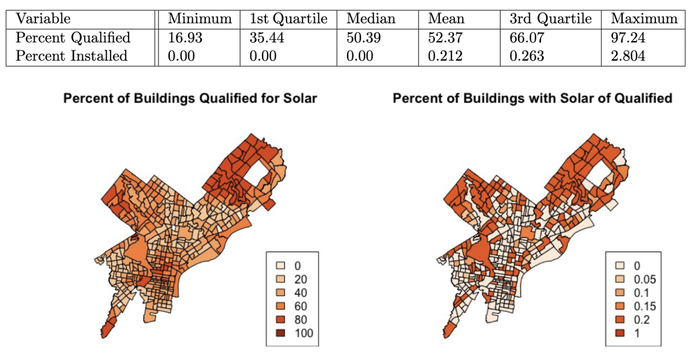
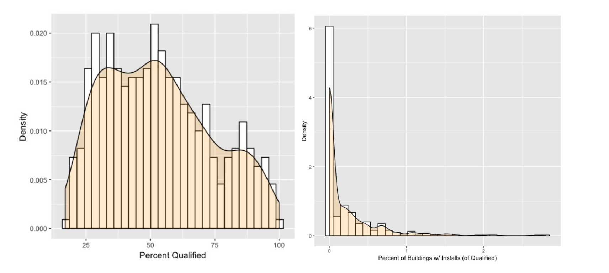
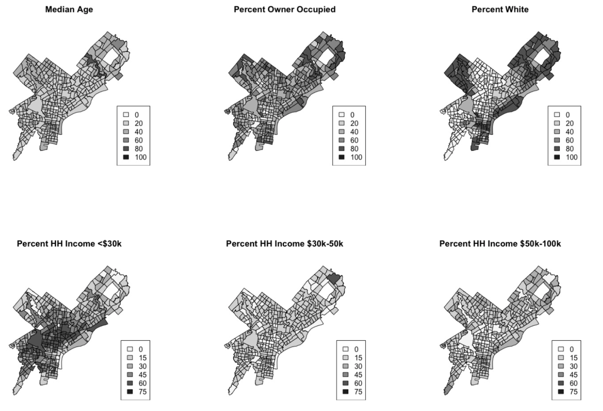

# Analysis of Rooftop Solar in Philadelphia, PA

## Objective

The purpose of this project is to evaluate rooftop solar in Philadelphia, PA using Google's Project Sunroof data.

### Methods Used
* Descriptive Statistics
* Inferential Statistics
* Spatial Analysis
* Data Visualization

### Technologies
* R 

## Project Background

The purpose of this analysis is to understand solar potential and adoption in Philadelphia PA.

Existing research points to significant disparities in the adoption of solar technologies across both race and income categories. While this existing research provides a useful overview of national rooftop solar trends, individual cities deserve closer examination. In particular, a better understanding of city-specific trends in solar panel adoption can help ensure more equitable and sustainable energy policies within those cities. This analysis focuses specifically on the city of Philadelphia, PA and explores whether the spatial and demographic trends within the city mirror those found nationally. 

## Project Findings

Findings from this analysis suggest that while race and income are both associated with higher levels of rooftop solar potential and adoption in Philadelphia, additional factors such as average household size and percent of households owner occupied may have greater effect sizes. The findings from this analysis also point to challenges in reliably and consistently measuring both rooftop solar potential and installations.

### Sample Data Visualizations

## Additional Details

For more details see:
* [Project code](https://github.com/aeevered/philadelphia-solar-analysis/blob/main/phl_solar_analysis_code.R)
* [Project paper](https://github.com/aeevered/philadelphia-solar-analysis/blob/main/phl_solar_analysis.pdf)
* [Presentation slides](https://github.com/aeevered/philadelphia-solar-analysis/blob/main/phl_solar_analysis_presentation.pdf)
